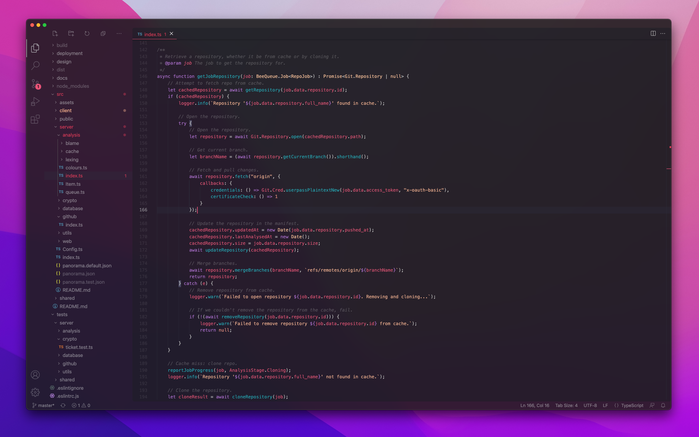

# How to make Visual Studio Code look good
So you want your Visual Studio Code to stop looking like a Microsoft product. It may not be as easy as it sounds, we are talking about Microsoft after all. Lucky for you, I've already done all the hard work, so here's how to beautify VSCode from start to finish.

<div class="text-align: center">
	
</div>

## 🎨 Colour theme
First off, you need to stop using the same theme that comes default out of the box. It's reminiscent of Visual Studio, which is never a good thing (bright green comments 🤮).

- Go to the Marketplace.
- Install *Horizon Theme*.
- Select it by pressing <kbd>⌘</kbd>+<kbd>Shift</kbd>+<kbd>P</kbd> (or <kbd>Ctrl</kbd>+<kbd>Shift</kbd>+<kbd>P</kbd> for you poor Windows users), typing in *"Color Theme"* and selecting *"Horizon"* from the dropdown.

## 🪟 Translucency
You gotta love that beautiful blur that you get nowadays in most UIs. Why does Visual Studio Code not have it out of the box? 

- Go to the Marketplace.
- Install *Vibrancy*.
- Restart Visual Studio Code when it asks you.

Upon restarting you should have a semi-ugly broken UI with some translucent blurry bits. Not to worry, we will fix it.

#### ⚠️ Warning
YMMV depending on your operating system. This was all tested on macOS but unless you're running an ancient version of Windows you should also be fine.

## 👨‍🔧 Fixing the UI
Now we get to the fun part, the CSS customisations that tie everything together.

- Go to the Marketplace.
- Install *"Customize UI"*.
- It may also ask you to install *Monkey Patch*, do it.

Now that it's installed (you may have to restart VSCode), we need to specify which elements on the page we want to change. Since we want to remove all those ugly non-transparent bits, you have to specify the CSS rules that allow you to remove the background colour of most elements.

Not to worry, I've already done it for you. 

- Open your VSCode *settings.json* file (<kbd>⌘</kbd>+<kbd>Shift</kbd>+<kbd>P</kbd> and type in *"Settings JSON"*).
- Paste in the following customisations.

```json
{
	"window.titleBarStyle": "custom",
	"customizeUI.titleBar": "inline",
	"customizeUI.stylesheet": {
		".statusbar": "background-color: transparent !important",
		"#workbench.parts.statusbar": "background-color: transparent !important",
		".editor": "border-radius: 5px; background-color: transparent; overflow: hidden;",
		".editor .content, .monaco-workbench .part.panel .pane-body.integrated-terminal .terminal-outer-container": "background-color: rgba(28, 30, 38, 0.5) !important",
		".title, .tabs, .tab, .activity-bar-placeholder, .monaco-editor, .monaco-editor-background, .monaco-editor .inputarea.ime-input, .monaco-editor .margin, .editor-container, .part.panel": "background-color: transparent !important",
		".pane-header": "background-color: transparent !important;",
		".editor > content": "background-color: rgb(28, 30, 38) !important; border-radius: 10px;",
		".composite.title > .title-label, .window-title, .activity-bar-placeholder": "display: none !important",
		".sidebar > .content": "margin-top: 5px !important",
		".sidebar .shadow": "display: none !important",
		".monaco-workbench .part.sidebar .title-actions .actions-container": "justify-content: space-evenly !important",
		".scrollbar .slider": "border-radius: 20px",
		".part.panel .composite.title": "border-top: none !important" ,
		".monaco-workbench .part.panel .pane-body.integrated-terminal .terminal-outer-container": "border-radius: 5px"
	},
	"vscode_vibrancy.theme": "Dark (Only Subbar)",
}
```

I know it looks like a jumbled mess but only machines understand CSS nowadays anyway, so stop complaining.

### 🔥 Some opinionated customisations
Realistically, you don't need half the shit that VSCode plonks on your screen every time you open it. If you wanna go full Zen mode, add the following customisations too. Be real, you don't look at the minimap.

```json
{
	"editor.minimap.enabled": false,
	"breadcrumbs.enabled": false
}
```

Now you're all set! Star this repo if you found it helpful and go impress everyone with your elusive VSCode configuration.

### ⚠️ Caveats
Don't expect this to work perfectly. This is obviously gonna be quite janky, you should only run this if you're confortable with a few UI glitches and issues.